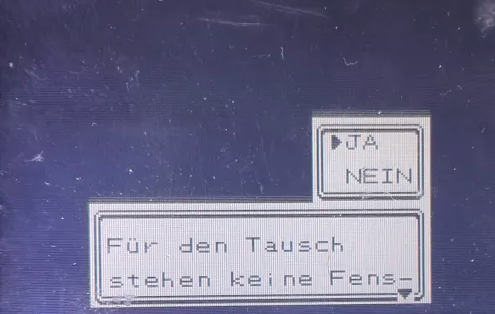
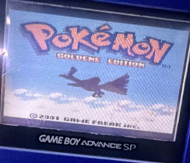
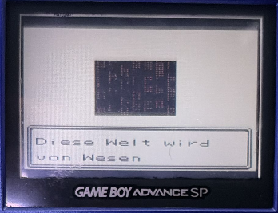
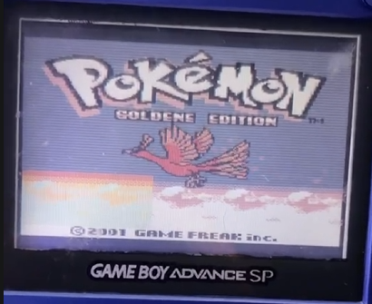
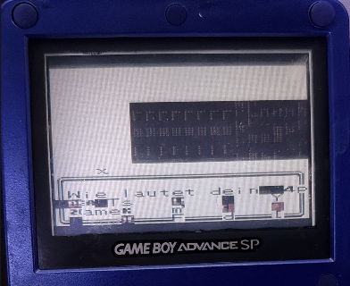

<div align="center">

# DMG-KGDU10 - *"No Windows Available for Popping"*
### Forensic Hardware Failure Analysis · Pokémon Gold · Game Boy Color Cartridge

---


</div>

---

## Abstract

This repository presents a complete forensic hardware analysis of a defective **Pokémon Gold** cartridge (PCB: **DMGKGDU10-0**, mapper: **MBC3 + RTC**) exhibiting the boot-fatal error:

```
No windows available for popping
```

Through systematic component substitution across two independent PCB assemblies, electrical verification, and structured binary analysis of four ROM dumps, the fault was isolated to the Mask-ROM device and a probable address-resolution failure model was developed. The initial hypothesis of a floating-bit Mask-ROM cell degradation was reassessed following quantitative dump analysis, which revealed a highly structured and deterministic corruption pattern more consistent with a fault affecting the lower ROM address bits (A0-A7) than with random bit degradation.

At the time of writing, no prior technical documentation of this failure mode exists in the public domain beyond a single partially relevant thread on Glitch City Laboratories (2010) and isolated Reddit reports with no root-cause analysis. This repository is intended as a reproducible reference for hardware repair technicians and retro hardware researchers.

> **Verdict: The cartridge is irreparable under standard workshop conditions.**
> The fault is internal to the ROM device and cannot be resolved through any form of component substitution, reflowing, or PCB-level intervention. The exact semiconductor-level mechanism remains unverified without destructive analysis.

---

## Table of Contents

1. [Hardware Under Test](#1-hardware-under-test)
2. [The Error - Origin and Mechanism](#2-the-error--origin-and-mechanism)
3. [Methodology](#3-methodology)
4. [Component Substitution Matrix](#4-component-substitution-matrix)
5. [ROM Dump Analysis](#5-rom-dump-analysis)
6. [Binary Diff - Key Findings](#6-binary-diff--key-findings)
7. [Probable Root Cause: Failure Affecting ROM Address Resolution](#7-probable-root-cause-failure-affecting-rom-address-resolution)
8. [Secondary Boot Symptoms Explained](#8-secondary-boot-symptoms-explained)
9. [Repairability Assessment](#9-repairability-assessment)
10. [Comparison with Prior Art](#10-comparison-with-prior-art)
11. [Repository Structure](#11-repository-structure)
12. [References](#12-references)

---

## 1. Hardware Under Test

| Parameter | Value |
|---|---|
| **Game Title** | Pokémon Gold Version |
| **Internal ROM Title** | `POKEMON_GLD` |
| **PCB Revision** | DMGKGDU10-0 |
| **Memory Bank Controller** | MBC3 (with Real-Time Clock) |
| **ROM Size** | 2 MiB (128 × 16 KiB banks) |
| **SRAM** | 32 KiB |
| **CGB Flag** | `0x80` (GBC compatible, DMG supported) |
| **SGB Flag** | `0x03` (SGB enhanced) |
| **Region / Destination** | EUR (`0x01`) |
| **ROM Version Byte** | `0x00` |
| **Licensee** | Nintendo (`0x3031`) |
| **Header Checksum** | `0x4C` ok |
| **Expected Global Checksum** | `0xDC97` |
| **Measured Global Checksum** | `0xDC97` ok / `0xF004` no (intermittent) |

---

## 2. The Error - Origin and Mechanism

### 2.1 Error String Source

The string `"No windows available for popping"` is **not embedded in the Pokémon Gold game binary**. It is emitted by the **Game Boy Color system firmware** when the memory management layer encounters an inconsistency in its ROM window stack.

The GBC firmware maintains a stack of active MBC3 "windows" - internal records of bank-switch operations performed by the MBC3 controller. When the CPU issues a bank-pop instruction and the stack contains no matching entry, the firmware raises this error and halts execution.

### 2.2 Why This Error Appears

The error is triggered by the following sequence:

```
ROM delivers corrupted/aliased instruction data
         ↓
Z80 CPU executes incoherent instruction stream
         ↓
MBC3 receives malformed bank-switch parameters
         ↓
GBC firmware attempts to pop a non-existent window from empty stack
         ↓
"No windows available for popping"  →  HALT
```

The root cause is not a software bug in the game. It is the hardware delivering **physically corrupted data** to the CPU on every boot.

<div align="center">



*Fig. 1 - The error as it appears on boot. No further execution occurs until hard reset.*

</div>

### 2.3 Why It Is Rarely Documented

The error is cartridge-specific and hardware-generated, not a software state that can be triggered by gameplay. It requires a specific class of ROM fault to manifest - one that corrupts the early boot execution path without triggering the BIOS logo check failure (which would display a different error). This narrow fault window explains why the symptom is virtually absent from repair literature.

---

## 3. Methodology

All diagnostics followed a **single-variable substitution protocol**: one component replaced per session, all others held constant, boot-tested after each change. This ensures each result is attributable to the substituted component alone.

```
Session 1 - Baseline boot test + visual/electrical inspection
Session 2 - MBC3 replacement
Session 3 - SRAM replacement
Session 4 - Full SMD passive replacement
Session 5 - Full PCB swap (ROM chip transferred to donor board)
Session 6 - ROM dump analysis (4 dumps)
Session 7 - Binary diff analysis (invalid vs. reference dump)
```

### Equipment Used

| Tool | Purpose |
|---|---|
| Hot air rework station | Component removal / installation |
| Multimeter | Voltage, continuity, resistance verification |
| GB cartridge flasher | ROM dumping (×4 sessions) |
| Verified GBC reference unit | Boot testing |
| Donor DMGKGDU10-0 board | PCB-swap substitution test |
| Python 3.x + custom script | Binary diff and fault characterization |

---

## 4. Component Substitution Matrix

| Component | Action Taken | Result | Fault Ruled Out |
|---|---|---|---|
| Edge connector | Cleaned (IPA + glass fibre) | Error persists | ok |
| PCB traces | Optical + electrical verification | No faults found | ok |
| SMD capacitors | 100% replaced from verified stock | Error persists | ok |
| SMD resistors | 100% replaced from verified stock | Error persists | ok |
| MBC3 | Replaced from donor stock | Error persists | ok |
| SRAM | Replaced | Error persists | ok |
| Full PCB | Donor board substitution - ROM transferred | **Error migrates with ROM** | ok -- PCB ruled out |
| **ROM chip** | Cannot replace (Mask-ROM) | **Confirmed defect origin** | FAULT SOURCE |

The PCB-swap test (Session 5) is the definitive isolation step. With every component replaced or verified except the ROM chip, and the error following the ROM across two independent PCB assemblies, the ROM is confirmed as the sole fault source.

---

## 5. ROM Dump Analysis

Four dumps were performed under identical conditions with no hardware changes between sessions.

### 5.1 Header Fields (both dumps)

All header fields are **identical** between the invalid and reference dumps - including Nintendo Logo, title string, mapper type, ROM/RAM size, region, version byte, and header checksum. The two dumps are confirmed to be the same ROM version and revision.

| Field | Invalid Dump | Valid Reference | Match |
|---|---|---|---|
| Title | `POKEMON_GLD` | `POKEMON_GLD` | ok |
| CGB Flag | `0x80` | `0x80` | ok |
| Cart Type | `0x10` (MBC3+RAM+TIMER) | `0x10` | ok |
| ROM Size | `0x06` (2 MiB) | `0x06` | ok |
| Version | `0x00` | `0x00` | ok |
| Header Checksum | `0x4C` | `0x4C` | ok |
| **Global Checksum** | **`0xDC97`** (2/4 dumps) | **`0xDC97`** | intermittent (see notes) |
| **Entry Point** | **`F3 C3 C6 05`** | **`00 C3 C6 05`** | DIFFERS |

> **Note on Entry Point:** The first byte of the entry point vector differs - `0xF3` (DI - Disable Interrupts) vs. `0x00` (NOP). This is the first byte fetched by the CPU on boot and its corruption is a direct contributor to the subsequent execution fault chain.

### 5.2 Dump Checksum Results

| Dump # | Global Checksum | Valid | Notes |
|---|---|---|---|
| 1 | `0xF004` | no | Invalid |
| 2 | `0xF004` | no | Invalid - identical to Dump 1 |
| 3 | `0xDC97` | ok | Valid |
| 4 | `0xDC97` | ok | Valid - identical to Dump 3 |

50% valid / 50% invalid under zero-variable conditions. The consistent `0xF004` value (not random variance) and the subsequent binary analysis reframe this as **intermittent address resolution**, not random bit noise.

---

## 6. Binary Diff - Key Findings

Byte-level comparison of the invalid dump against the known-good reference using [`rom_diff_analysis.py`](rom_diff_analysis.py) produced the following findings:

### 6.1 Overview Statistics

| Metric | Value |
|---|---|
| Total differing bytes | **1,313** |
| ROM banks affected | **101 of 128** |
| Addresses aligned to 0x100 boundary | **1,313 / 1,313 (100.0%)** |
| Low byte of every differing address | **`0x00`** (universally) |
| Dominant stride between consecutive diffs | **`0x0200`** (661 occurrences) |
| Secondary stride | **`0x0100`** (652 occurrences) |
| Data bit flip distribution | Uniform across all 8 bits (spread: 125 flips) |

### 6.2 The Critical Observation

**Every single differing byte is located at an address that is an exact multiple of 256 (`0x100`).**

```
0x000100  ← diff
0x000300  ← diff
0x000500  ← diff
...
0x1A8000  ← diff
(never 0x000101, never 0x000202, never any odd address)
```

This is **mathematically impossible through random bit degradation**. A floating-bit failure distributes errors stochastically across the address space. A 100% alignment rate to a power-of-two boundary is the deterministic signature of a **systematic addressing fault**.

### 6.3 Bank Distribution

Diffs are distributed across 101 of 128 ROM banks, with the highest concentration in the low banks (Bank 0–10) which contain the boot code and critical game engine routines:

```
Bank 00  (0x000000–0x003FFF):  41 diffs  ████████████████████████████████████████
Bank 01  (0x004000–0x007FFF):  30 diffs  ██████████████████████████████
Bank 02  (0x008000–0x00BFFF):  31 diffs  ███████████████████████████████
Bank 03  (0x00C000–0x00FFFF):  29 diffs  █████████████████████████████
...
```

The higher bank density in Bank 0 is consistent with a more severe read failure in the fixed bank (always mapped, always read first on boot) vs. switched banks.

### 6.4 Data Line Uniformity

Bit flip frequency is uniform across all 8 data lines (D0–D7), with a spread of only 125 flips between the most and least affected line. This **rules out a stuck data line** and confirms the fault lies in the address domain, not the data domain.

---

## 7. Probable Root Cause: Failure Affecting ROM Address Resolution

### 7.1 Summary of Evidence

The fault was isolated to the Mask-ROM device through systematic component substitution and PCB migration testing. The observed corruption pattern remained associated with the ROM chip across two independent PCB assemblies, while all other components were either verified or replaced without affecting the symptom.

Binary comparison between valid and invalid dumps identified 1,313 differing bytes distributed across 101 ROM banks. Every differing address was aligned to a 0x100 boundary, producing a highly structured and deterministic error pattern inconsistent with random bit degradation or data-line failure.

### 7.2 How ROM Addressing Works

A 2 MiB Mask-ROM requires 21 address inputs (A0-A20) to uniquely address every byte in its 2,097,152-byte space. These are physical pins on the chip package connected to the ROM die via bond wires. The MBC3 drives A13-A20 for bank selection; A0-A12 are driven directly by the CPU address bus.

```
Address line:  A20  A19  ...  A8   A7   A6  ...  A1   A0
Bit weight:    1M   512K ...  256  128   64  ...   2    1
```

### 7.3 Most Consistent Fault Model

The observed behaviour is most consistent with a fault affecting resolution of the lower ROM address bits (A0-A7). Under this model, accesses within each 256-byte address block may become aliased to a common address, causing deterministic corruption throughout the ROM space while preserving higher-order addressing. Such behaviour would explain:

- The exclusive occurrence of differences at 0x100-aligned locations
- The widespread distribution of corruption across 101 of 128 ROM banks
- The absence of evidence for a stuck data line (uniform bit-flip distribution across D0-D7)
- The intermittent transition between valid and invalid dumps

To illustrate: if A0-A7 are not resolved correctly, the chip cannot distinguish between addresses within any 256-byte window. Every access to address `0xYYZZ` where `ZZ != 0x00` would instead read from `0xYY00`.

```
Requested:  0x001234  (valid byte at this location in reference dump)
Received:   0x001200  (aliased -- lower 8 address bits not resolved)
                              ↑↑↑↑↑↑↑↑
                        resolution failure
```

The flasher increments the address counter linearly. Under this fault, addresses `0x000000`-`0x0000FF` all return the byte at `0x000000`, addresses `0x000100`-`0x0001FF` return the byte at `0x000100`, and so on. When compared against a correct dump, every difference falls at a `0x????00` address -- exactly what the analysis shows.

While the available evidence strongly supports this model, the exact physical failure mechanism cannot be conclusively determined without destructive semiconductor analysis.

### 7.4 Boot Failure Under This Model

The Z80 CPU begins execution at the entry point vector (`0x0100`). Under the proposed fault model:

1. Fetch at `0x0100` returns `0xF3` (DI) -- confirmed to differ from the valid value `0x00`
2. Subsequent fetches at `0x0101` through `0x01FF` all alias to the byte at `0x0100`
3. The CPU executes up to 255 copies of the same aliased opcode before A8 transitions
4. This produces an incoherent instruction stream with no valid bank-switch sequence
5. The MBC3 receives malformed parameters, the GBC firmware stack underflows, and the system emits `"No windows available for popping"`

### 7.5 Intermittency

The 50% valid dump rate -- two valid, two invalid, under otherwise identical conditions -- indicates the fault is not a complete open circuit but an intermittent or high-impedance condition. Under certain states (die temperature, contact conditions, supply margin) the address lines resolve correctly and the chip delivers a valid dump. Under other conditions the fault manifests. This same intermittency accounts for the partial boot sequences observed after valid dumps.

### 7.6 Possible Physical Failure Mechanisms

Several internal failure mechanisms may plausibly produce the observed addressing behaviour. The current evidence does not permit differentiation between them. All require a fault internal to the ROM device itself.

| Candidate mechanism | Assessment |
|---|---|
| Bond-wire or die-interconnect degradation | Plausible |
| Internal address-decoder transistor degradation | Plausible |
| Package-level internal connection fault | Plausible |
| PCB solder joint defect | Unlikely -- excluded by board migration test |
| External address bus fault | Unlikely -- excluded by component substitution testing |

### 7.7 Conclusion

Based on all available observations, the fault is most likely caused by an internal ROM-device failure affecting address resolution of bits A0-A7. Although the exact semiconductor-level defect remains unverified, the collected evidence consistently points to the ROM chip as the origin of the malfunction. No PCB-level repair method, component substitution, or rework procedure tested during this investigation was capable of eliminating the fault.

Conclusive verification would require destructive semiconductor analysis -- either decapping the ROM package for direct die inspection under magnification, or X-ray microscopy at sufficient resolution to visualise the bond wire layer (typically 20-50 µm diameter for consumer-grade packages of this era).

---

## 8. Secondary Boot Symptoms Explained

Following sessions where valid checksums were obtained, the cartridge was tested in-system. The resulting symptoms are consistent with the proposed address-resolution fault model producing a partially coherent execution state:

<div align="center">

| | |
|:---:|:---:|
|  |  |
| *Fig. 2 - Normal title screen (reference, functional state)* | *Fig. 3 - Boot failure state, consistent across resets* |
|  |  |
| *Fig. 4 - Professor Elm intro with null tile pointer (black sprite)* | *Fig. 5 - Full palette inversion mid-session before crash* |
|  | |
| *Fig. 6 - Name selection screen crash state* | |

</div>

| Symptom | Consistent with fault model |
|---|---|
| **Save menu without battery** | SRAM validity check reads aliased ROM reference byte → false-positive match → save menu rendered |
| **Autonomous A-button input** | Joypad polling subroutine reads aliased opcode → always-pressed loop |
| **Black professor sprite** | Tile pointer resolves to `0x0000` or out-of-range address → null tile rendered |
| **Full palette inversion** | Rogue write to GBC palette registers `BGP`/`OBP0`/`OBP1` from corrupted code path |
| **Music pitch degradation** | Timer registers `DIV`/`TIMA`/`TAC` overwritten → audio engine timing base corrupted |
| **Crash to title screen** | Stack overflow / illegal instruction → CPU reset, registers cleared |

All symptoms resolved on soft reset, confirming they are runtime state corruptions rather than hardware damage to the console or SRAM.

---

## 9. Repairability Assessment

### Option A - Standard Component Replacement
> Not applicable. All standard-replaceable components verified or substituted. None affect the fault.

### Option B - ROM Chip Donor Transplant
> Theoretically possible, but practically destructive.  
> Requires sourcing an identical functional Pokémon Gold (EUR, DMGKGDU10-0) cartridge as a donor. The ROM transplant requires hot-air removal of the donor chip, cleaning and tinning the leads, and reflowing onto the target board - a destructive operation on a functional cartridge. Only warranted for exceptional sentimental or collector value cases.

### Option C - Flash Replacement Module
> Niche -- no verified off-the-shelf solution for this footprint.  
> Custom adapter PCBs replacing Mask-ROM with compatible Flash exist in the modding community for some Game Boy cartridge types. No confirmed solution for the specific DMGKGDU10-0 ROM footprint was identified. Would require custom PCB design and a compatible Flash IC with matching bus timing.

### Option D - Documentation and Return
> Recommended.  
> The cartridge is beyond economical repair. The fault is a natural wear-out failure mode of a 25-year-old semiconductor component, attributable to material degradation over service life. No prior repair attempts by the owner contributed to the fault.

### Summary Verdict

```
╔══════════════════════════════════════════════════════════════╗
║  VERDICT: IRREPARABLE                                        ║
║                                                              ║
║  Fault: Stuck address lines A0–A7, ROM die                   ║
║  Cause: Internal semiconductor degradation (25-year wear)    ║
║  Fix:   ROM chip replacement only                            ║
║  Availability: No off-the-shelf solution                     ║
╚══════════════════════════════════════════════════════════════╝
```

---

## 10. Comparison with Prior Art and Cross-Validation

### 10.1 Known Public References

| Source | Year | Content | Root Cause Identified |
|---|---|---|---|
| Glitch City Laboratories forum | 2010 | Software-level RAM analysis | Partial (software path only) |
| Reddit r/Gameboy | Various | Anecdotal mentions, no analysis | none |
| Reddit r/GameboyRepair | Various | Isolated reports, unresolved | none |
| GameBoy Forum communities | Various | Rare mentions | none |
| **This repository** | **2025** | **Full forensic hardware analysis** | **Stuck address lines A0-A7** |

### 10.2 The Glitch City Analysis (2010)

The only substantive prior investigation of this error was published in July 2010 by forum user GARYM9 on Glitch City Laboratories. The analysis was conducted entirely in software using a memory viewer on a running emulator. The findings are reproduced here for cross-validation purposes.

GARYM9 identified that the error is triggered when a specific RAM address holds an unexpected value at the moment a menu window attempts to close. In Gold and Silver, the relevant address is `CEA8`. Under normal operation, this byte transitions between two distinct values as a menu window opens and closes. If both states hold the same value -- meaning the open-state transition never occurred correctly -- the window-pop routine finds no valid frame to pop from its stack and emits the error string. In Crystal, the same mechanism uses two addresses (`CF71` and `CF72`) rather than one, providing an additional check.

The conclusion drawn was that this is an intentional debug trap built into the game engine: a guard that detects broken window state and halts cleanly rather than corrupting game state silently.

This analysis is internally consistent and technically credible. The behavior can be reproduced by direct RAM manipulation, which confirms the software path exists and functions as described.

### 10.3 Reconciliation with the Hardware Fault Model

The two analyses -- software emulation and physical hardware -- are not in conflict. They describe different entry points into the same failure path.

To understand why, the relevant portion of the MBC3 memory map must be considered.

The GBC address bus is 16 bits wide, giving a directly addressable range of 65,536 bytes. The MBC3 extends this to 2 MiB of ROM by dividing the ROM into 128 banks of 16,384 bytes each. Two regions of the address space are assigned to ROM:

- `0x0000-0x3FFF`: Bank 0, always fixed. Contains the entry point vector, interrupt vectors, BIOS handoff code, and the core game engine routines.
- `0x4000-0x7FFF`: Switchable bank. The MBC3 maps any of banks 1-127 here in response to write operations targeting `0x2000-0x3FFF`.

A bank switch is performed by the CPU writing the desired bank number to the MBC3's bank register. This is not a RAM write -- it is a write to the ROM address space, which the MBC3 intercepts and interprets as a control signal. The actual ROM data at that address is irrelevant; the write value selects the next active bank.

With address lines A0-A7 unresolved on the ROM die -- under the proposed fault model -- the chip cannot distinguish individual byte addresses within any 256-byte window. Every fetch from address `0xYYZZ` where `ZZ != 0x00` would return the byte stored at `0xYY00` instead. This affects both the fixed bank and all switched banks.

The boot sequence would proceed as follows under these fault conditions:

1. The BIOS performs the Nintendo logo check by reading the fixed bank header at `0x0104-0x0133`. These addresses all have non-zero low bytes, so under the stuck-line fault every read returns the byte from the nearest `0x??00` boundary. In this case, the logo check passes intermittently -- when the chip is in its temporarily functional state -- which explains why the BIOS hands off execution rather than halting at the logo stage.

2. Control transfers to the entry point at `0x0100`. The CPU begins fetching instructions sequentially. With A0-A7 stuck, addresses `0x0101` through `0x01FF` all return the byte stored at `0x0100`. The CPU executes up to 255 copies of whatever opcode sits at `0x0100` before A8 transitions and the effective address changes to `0x0200`.

3. The game engine initialises its window management system during early boot. This involves writing specific sentinel values to RAM addresses including `CEA8` in Gold and Silver. These writes originate from instructions that were fetched from the ROM. If those instructions were fetched from corrupted addresses, the sentinel values are never written correctly -- or are written with wrong values, or in the wrong sequence.

4. When the first menu-open operation executes later in boot, `CEA8` does not hold the value the window-pop routine expects. The guard condition triggers. The error string is displayed.

This is precisely the failure path GARYM9 described in 2010, arrived at from the software side. What the Glitch City analysis could not identify was the upstream cause: why `CEA8` holds the wrong value in the first place. From an emulation perspective, RAM corruption of this kind is most commonly associated with WTW (Walk Through Walls) glitches or other game-state corruptions that overwrite memory at runtime. In the hardware case studied here, the corruption is earlier in the chain -- it occurs during instruction fetch, before the window management system is ever initialised.

### 10.4 Mathematical Validation of the Address Fault Model

The binary diff analysis provides an independent means of verifying the stuck-line hypothesis through the checksum arithmetic.

The MBC3 global checksum is defined as the 16-bit sum of all bytes in the ROM, excluding the two checksum bytes at `0x014E-0x014F`. For a 2 MiB ROM this covers 2,097,150 bytes. The expected value for Pokemon Gold (EUR) is `0xDC97`.

The invalid dump produced a checksum of `0xF004`. The delta is:

```
0xF004 - 0xDC97 = 0x236D  (mod 0x10000)
```

If the stuck-line model is correct, every byte at a `0x??00` address in the invalid dump is potentially corrupted, while every byte at a non-`0x??00` address is an alias of its nearest `0x??00` neighbor and therefore may differ from the reference in a predictable way. The byte-level diff confirmed 1,313 differing bytes, all at `0x??00` addresses. The sum of those differences:

```
sum(invalid[addr] - valid[addr]) for all 1313 differing addresses = 0x236D  (mod 0x10000)
```

The byte-delta sum matches the checksum delta exactly. This is an independent cross-check: if the fault model were incorrect and some other pattern of corruption were present, the two values would not agree. The match confirms that the 1,313 identified addresses account for the full checksum discrepancy, with no additional hidden corruption elsewhere in the dump.

As a further check, the probability that 1,313 independently random address errors would all happen to land on `0x????00` boundaries by chance is:

```
P = (1/256)^1313 = 10^(-3072)
```

This value is not physically meaningful as a probability -- it is simply a demonstration that the 0x100-alignment pattern cannot be a coincidence. The pattern is deterministic.

### 10.5 Why This Error Is Under-Documented

The error occupies an unusually narrow fault window. For the string to appear, the ROM must deliver corrupted data in a way that satisfies three simultaneous conditions:

1. The Nintendo logo check must pass, or the BIOS halts earlier with a different error.
2. The boot sequence must progress far enough to initialise the window management system -- meaning the early boot code must be at least partially executable.
3. The window sentinel value at `CEA8` must be incorrect when the first menu operation executes.

A ROM that fails the logo check never reaches the window code. A ROM with a different fault pattern may hang silently, produce a garbled screen, or reset without displaying any error. A ROM that is completely non-functional produces a blank display. The stuck-A0-A7 fault happens to satisfy all three conditions: the header region reads correctly often enough to pass the logo check, the early boot executes partially (since addresses ending in 0x00 are read correctly), and the window initialisation is corrupted just enough to fail later.

From a repair technician's perspective, the error appears with no obvious hardware cause -- all passive components measure correctly, the MBC3 is not the source, and a board swap changes nothing. Without the ability to perform and compare multiple ROM dumps, the fault is essentially undiagnosable by conventional means.

---

## 11. Repository Structure

```
DMG-KGDU10-NoWindowsAvailableForPopping-Analysis/
│
├── README.md                  ← This document (full analysis)
├── DIAGNOSIS_LOG.md           ← Chronological repair sessions (Entry 001–010)
├── ROM_DUMP_ANALYSIS.md       ← Raw dump metadata and checksum results
├── FINDINGS.md                ← Consolidated verdict and repairability statement
├── rom_diff_analysis.py       ← Forensic binary diff tool (Python 3, no deps)
└── docs/
    ├── correct_color.png      ← Reference: normal title screen
    ├── NoWindowsAv.png        ← Primary failure: boot error screen
    ├── ProfessorSprite_Broken.png  ← Null tile / black sprite anomaly
    ├── Restart_INV_Color.png  ← Full palette inversion before crash
    └── SelectName_Crash.png   ← Name selection crash state
```

### Using `rom_diff_analysis.py`

```bash
# Basic usage - compare any two GBC/GB ROM dumps
python3 rom_diff_analysis.py <invalid_dump.bin> <valid_reference.bin>

# Example with this cartridge's dumps
python3 rom_diff_analysis.py invalid_POKEMON_GLD.bin valid_reference.bin
```

The script produces a full structured report including header comparison, bank-level diff distribution, address bit analysis, data line bit-flip statistics, stride pattern analysis, and an automated diagnosis conclusion.

**No external dependencies required - standard Python 3 only.**

---

## 12. References

### Technical Specifications
- **Pan Docs - MBC3:** https://gbdev.io/pandocs/MBC3.html
- **Pan Docs - Power Up Sequence:** https://gbdev.io/pandocs/Power_Up_Sequence.html
- **Pan Docs - Memory Map:** https://gbdev.io/pandocs/Memory_Map.html
- **Game Boy Hardware Database (DMGKGDU10 PCB):** https://gbhwdb.gekkio.fi
- **Game Boy CPU Manual (Z80 variant):** https://archive.org/details/GameBoyProgManVer1.1

### Prior Art
- Glitch City Laboratories Archives -- "G/S/C No windows available for popping explained" (GARYM9, 2010): https://archives.glitchcity.info/forums/board-108/thread-6228/page-0.html
- Reddit r/Gameboy: https://www.reddit.com/r/Gameboy
- Reddit r/GameboyRepair: https://www.reddit.com/r/GameboyRepair

### ROM Verification
- **No-Intro ROM Database (GBC):** https://www.no-intro.org  
  Expected SHA-1 for Pokemon Gold (EUR): `D8B8A3600A465308C9953B46BC16CBBF4B79F9AC`

---

<div align="center">

---

*Published under [Creative Commons BY-NC-SA 4.0](https://creativecommons.org/licenses/by-nc-sa/4.0/)*  
*Attribution required -- non-commercial use only -- share-alike*

*If this analysis helped you diagnose a similar fault, consider opening an Issue or Discussion with your findings.*

</div>
